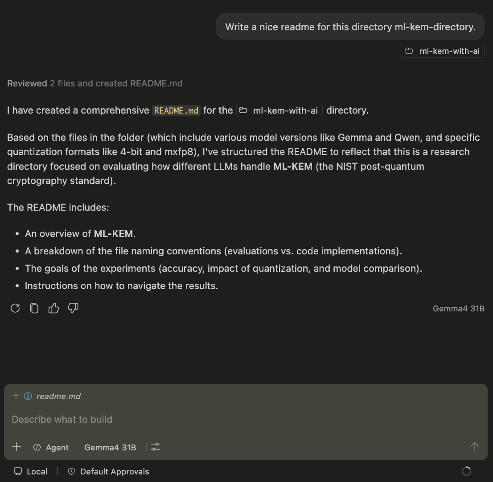
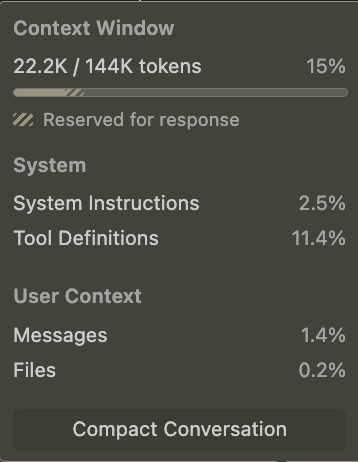

## Bonus

The readme was generated by gemma 4 31B 4 bit model.

The generation took 30 mins 45 seconds on Macbook Pro M3 Pro 36gb.

### command

```sh
mlx_vlm.server 
 --model mlx-community/gemma-4-31B-it-4bit
 --log-level DEBUG 4 — Python -E ~/.local/bin/mlx_vlm.server
 --model mlx-community/gemma-4-31B-it-4bit
 --log-level DEBUG --kv-bits 4 --kv-quant-scheme turboquant
```

### instructions

#### Prompt:
Write a nice readme for this directory ml-kem-directory.
[directory attached as context]

#### Agent UI:


#### Context uage:


### logs

Using cached model: mlx-community/gemma-4-31B-it-4bit, Adapter: None
2026-06-12 22:00:11,380 - DEBUG - chat/completions request: model=mlx-community/gemma-4-31B-it-4bit images=0 audio=0 max_tokens=2048 temp=0.1 stream=True
INFO:     127.0.0.1:55900 - "POST /v1/chat/completions HTTP/1.1" 200 OK
2026-06-12 22:08:03,413 - DEBUG - chat/completions stream done: tokens=32 total_time=472.04s
Stream finished, cleared cache.
Using cached model: mlx-community/gemma-4-31B-it-4bit, Adapter: None
2026-06-12 22:08:06,579 - DEBUG - chat/completions request: model=mlx-community/gemma-4-31B-it-4bit images=0 audio=0 max_tokens=2048 temp=0.1 stream=True
INFO:     127.0.0.1:55900 - "POST /v1/chat/completions HTTP/1.1" 200 OK
2026-06-12 22:13:48,548 - DEBUG - chat/completions stream done: tokens=56 total_time=341.97s
Stream finished, cleared cache.
Using cached model: mlx-community/gemma-4-31B-it-4bit, Adapter: None
2026-06-12 22:13:49,758 - DEBUG - chat/completions request: model=mlx-community/gemma-4-31B-it-4bit images=0 audio=0 max_tokens=2048 temp=0.1 stream=True
INFO:     127.0.0.1:55900 - "POST /v1/chat/completions HTTP/1.1" 200 OK
2026-06-12 22:23:49,138 - DEBUG - chat/completions stream done: tokens=482 total_time=599.39s
Stream finished, cleared cache.
Using cached model: mlx-community/gemma-4-31B-it-4bit, Adapter: None
2026-06-12 22:23:52,534 - DEBUG - chat/completions request: model=mlx-community/gemma-4-31B-it-4bit images=0 audio=0 max_tokens=2048 temp=0.1 stream=True
INFO:     127.0.0.1:55900 - "POST /v1/chat/completions HTTP/1.1" 200 OK
2026-06-12 22:30:56,966 - DEBUG - chat/completions stream done: tokens=163 total_time=424.44s
Stream finished, cleared cache.